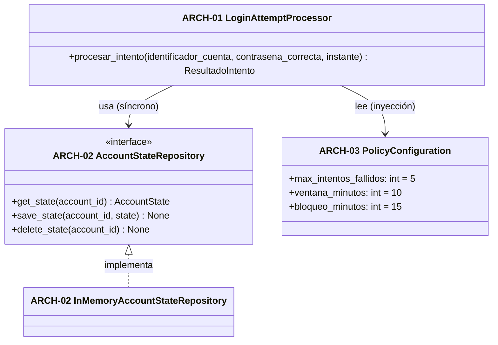

# Contrato de arquitectura — SPEC-AUT-03

Eslabón **Specification → Architecture Contract** de la cadena SDD.

- **Especificación de origen:** `specs/specification.json` (SPEC-AUT-03 v1.0.0).
- **Restricciones técnicas:** `context/sdd_restricciones_tecnicas.md` (R1-R6).
- **Diseño propuesto por:** Nemotron 3 Super con el prompt aprobado de la fase 3
  (`evidence/punto8_sdd/ejecuciones/3_arquitectura.json`, salida completa sin editar).
- **Quality Gate de la fase:** no pasó tal como salió del modelo (ver §5); este
  documento es la versión **corregida y aprobada** (decisión en `DECISIONES.md` §3).

La §2 es **normativa**: el código de `src/auth_lockout/` debe cumplirla
exactamente, y las pruebas la verifican. Lo demás documenta el diseño.

## 1. Componentes

Estilo: capas limpias, con la lógica de negocio independiente de la
infraestructura (diseño de Nemotron, sin cambios de fondo).

| ID | Componente | Módulo | Responsabilidad | Cubre |
|---|---|---|---|---|
| ARCH-01 | `LoginAttemptProcessor` | `src/auth_lockout/procesador.py` | Aplica la política de bloqueo a cada intento y devuelve el resultado | SPEC-AUT-03 (RB-1 a RB-8, AC-AUT-03-01 a 07) |
| ARCH-02 | `AccountStateRepository` + `InMemoryAccountStateRepository` | `src/auth_lockout/repositorio.py` | Guarda y recupera el estado de cada cuenta detrás de una interfaz reemplazable | SPEC-AUT-03 (RB-1, RB-7); R3 |
| ARCH-03 | `PolicyConfiguration` | `src/auth_lockout/politica.py` | Parámetros de la política con los valores del requisito como predeterminados | SPEC-AUT-03 (parámetros de RB-2, RB-3, RB-6); R5 |



## 2. Contrato normativo

Paquete `src/auth_lockout/` (Python 3.12, solo biblioteca estándar). La API
pública se exporta desde `src/auth_lockout/__init__.py`.

```pyi
# ARCH-03 — src/auth_lockout/politica.py
@dataclass(frozen=True)
class PolicyConfiguration:
    max_intentos_fallidos: int = 5   # SPEC-AUT-03 parametros.max_intentos_fallidos
    ventana_minutos: int = 10        # SPEC-AUT-03 parametros.ventana_minutos
    bloqueo_minutos: int = 15        # SPEC-AUT-03 parametros.bloqueo_minutos
    # ValueError si algún valor no es un int >= 1 (bool no cuenta como int).

# ARCH-02 — src/auth_lockout/repositorio.py
@dataclass
class AccountState:
    failed_attempts: list[datetime] = field(default_factory=list)  # instantes UTC dentro de la ventana
    lock_until: datetime | None = None                             # fin del bloqueo vigente

class AccountStateRepository(Protocol):
    def get_state(self, account_id: str) -> AccountState: ...   # estado vacío si no hay registro
    def save_state(self, account_id: str, state: AccountState) -> None: ...
    def delete_state(self, account_id: str) -> None: ...        # no falla si no hay registro

class InMemoryAccountStateRepository:  # implementa AccountStateRepository
    # get_state devuelve una COPIA: modificar el resultado no altera lo guardado.

# ARCH-01 — src/auth_lockout/procesador.py
class ResultadoAutenticacion(StrEnum):
    EXITOSO = "EXITOSO"
    CREDENCIALES_INVALIDAS = "CREDENCIALES_INVALIDAS"
    CUENTA_BLOQUEADA = "CUENTA_BLOQUEADA"

@dataclass(frozen=True)
class ResultadoIntento:
    resultado_autenticacion: ResultadoAutenticacion
    cuenta_bloqueada_hasta: datetime | None
    contador_intentos_fallidos: int
    mensaje: str                                  # no vacío; el texto no es parte del contrato
    def como_dict(self) -> dict[str, str | int | None]: ...
    # Mismas claves que las salidas de SPEC-AUT-03; cuenta_bloqueada_hasta en
    # ISO 8601 "YYYY-MM-DDTHH:MM:SSZ" (o None); resultado_autenticacion como texto.

class LoginAttemptProcessor:
    def __init__(self, repository: AccountStateRepository,
                 policy: PolicyConfiguration | None = None) -> None: ...
    # policy=None usa PolicyConfiguration() con los valores predeterminados.
    def procesar_intento(self, identificador_cuenta: str, contrasena_correcta: bool,
                         instante: datetime) -> ResultadoIntento: ...
```

**Errores de `procesar_intento`** (se validan antes de tocar el estado):

| Condición | Error |
|---|---|
| `identificador_cuenta` no es `str` | `TypeError` |
| `identificador_cuenta` está vacío o solo tiene espacios | `ValueError` |
| `contrasena_correcta` no es `bool` | `TypeError` |
| `instante` no es `datetime` | `TypeError` |
| `instante` no tiene zona horaria o su desfase no es 0 (UTC) | `ValueError` |

**Algoritmo** (V = `ventana_minutos`, B = `bloqueo_minutos`, M = `max_intentos_fallidos`):

1. Leer el estado de la cuenta.
2. **Bloqueo vigente** (`lock_until` no es None e `instante < lock_until`): devolver
   `CUENTA_BLOQUEADA`, `cuenta_bloqueada_hasta = lock_until`,
   `contador_intentos_fallidos = M`, **sin modificar el estado**, aunque la
   contraseña sea correcta (RB-4, RB-8, D-08).
3. **Bloqueo vencido** (`lock_until` no es None e `instante >= lock_until`): el
   estado vuelve a vacío (RB-6, D-03, D-05) y se sigue con el paso 4.
4. **Contraseña correcta:** eliminar el estado de la cuenta (`delete_state`) y
   devolver `EXITOSO`, `None`, `0` (RB-5, D-04).
5. **Contraseña incorrecta:** descartar los intentos con `instante - t > V minutos`
   (uno de exactamente V minutos todavía cuenta: D-02), agregar `instante` (RB-1).
   - Si quedan **M o más**: `lock_until = instante + B minutos`, guardar y devolver
     `CUENTA_BLOQUEADA`, `lock_until`, `M` (RB-3).
   - Si no: guardar y devolver `CREDENCIALES_INVALIDAS`, `None`, número de intentos
     en la ventana (RB-2).

El estado de cada cuenta es independiente del de las demás (RB-7).

## 3. Decisiones de diseño

Las de Nemotron (D1-D7 de su salida), con la restricción que las justifica:

| Decisión | ARCH | Justificación |
|---|---|---|
| Ventana deslizante sobre instantes guardados | ARCH-01 | R2 (el tiempo llega como parámetro), R3 |
| Estado = lista de instantes fallidos + fin de bloqueo | ARCH-02 | R3 (interfaz reemplazable), R1 (solo biblioteca estándar) |
| Política inyectada e inmutable | ARCH-01, ARCH-03 | R5 (sin constantes sueltas) |
| Los intentos durante el bloqueo no lo modifican | ARCH-01 | D-08 de la especificación |
| Contador a 0 tras éxito y tras vencer el bloqueo | ARCH-01 | RB-5, RB-6, D-05 |
| Interfaz síncrona, sin colas | ARCH-01, ARCH-02 | R1, R6 |

## 4. Riesgos (de Nemotron, aceptados)

| Riesgo | Tratamiento en esta versión |
|---|---|
| Crecimiento del estado en memoria con muchas cuentas | Mitigado por C-06: tras un éxito el estado se elimina y los intentos viejos se descartan en cada fallo. La implementación PostgreSQL (fase posterior, R3) lo resuelve del todo |
| Concurrencia: dos intentos simultáneos de la misma cuenta | Fuera de alcance de la versión en memoria; la implementación PostgreSQL deberá dar atomicidad por cuenta |

## 5. Quality Gate y correcciones de la revisión

Resultado automático sobre la salida de Nemotron (mismo calificador de
arquitectura del benchmark, `benchmarks/calificadores.py`): 9/9 secciones,
SPEC-AUT-03 cubierto, ARCH-01..03 secuenciales; **fallas**: ARCH no presentes
en el diagrama, bloque de código de implementación dentro del diseño y
**una afirmación de verificación no realizada**. Correcciones aplicadas:

| ID | Problema en la salida del modelo | Corrección |
|---|---|---|
| C-01 | Marca como hecho "[x] Se ha verificado el diagrama con un linter de Mermaid (mermaid.live) y ... un script de trazabilidad". No se hizo (defecto conocido del prompt aprobado, punto 4) | Eliminado. La verificación real está en §6 |
| C-02 | "[x] El diagrama ... contiene todos los ARCH-XX": falso, usaba solo nombres de clase | Diagrama rehecho con las etiquetas ARCH-01..03 |
| C-03 | `timestamp_intento: str` (ISO 8601) | `instante: datetime` con zona UTC; `ValueError` si no la tiene (R2, D-07) |
| C-04 | Un correo con formato inválido se trataba como `CREDENCIALES_INVALIDAS` | El identificador es opaco: solo se exige texto no vacío; el formato del correo lo valida el backend (D-01, R4) |
| C-05 | Devolvía un `dict` sin tipo | `ResultadoIntento` (dataclass inmutable) y `ResultadoAutenticacion` (enum), con `como_dict()` para las salidas de la especificación |
| C-06 | La interfaz del repositorio solo tenía `get_state` y `save_state` | Se agrega `delete_state`: tras un éxito no queda registro (minimización, alerta legal de la especificación) |
| C-07 | No definía el contador mientras la cuenta está bloqueada ni los límites exactos de ventana y bloqueo | Algoritmo normativo de §2: contador = M durante el bloqueo; límites de D-02 y D-03 |
| C-08 | Bloque `python` con la clase `AccountState` dentro del diseño (el prompt lo prohíbe) | Reemplazado por el contrato en formato stub (`pyi`) de §2: firmas y tipos, sin implementación |
| C-09 | *Defecto de la revisión, no del modelo*, detectado por el Quality Gate de la implementación (ruff B008): la firma pedía `policy = PolicyConfiguration()`, una llamada en un valor por defecto | `policy: PolicyConfiguration \| None = None` |
| C-10 | *Defecto de la revisión*, detectado por ruff TRY004: pedía `ValueError` para argumentos de tipo incorrecto | Tipo incorrecto → `TypeError`; valor inválido → `ValueError` |

## 6. Verificación real (herramientas)

| Verificación | Cómo | Resultado |
|---|---|---|
| ARCH-01..03 secuenciales y presentes en el diagrama | `calificar_fase3` sobre este documento | ver `DECISIONES.md` §3 |
| SPEC-AUT-03 cubierto por al menos un ARCH | idem y `python -m sdd.trazabilidad` | ver `specs/traceability_matrix.md` |
| Cada ARCH implementado en un módulo que lo declara (`Implements:`) | `python -m sdd.trazabilidad` | ver `specs/traceability_matrix.md` |
| Sintaxis Mermaid | **No verificada con herramienta** (no hay mermaid-cli en la máquina); revisión visual | pendiente de verificar con herramienta |
